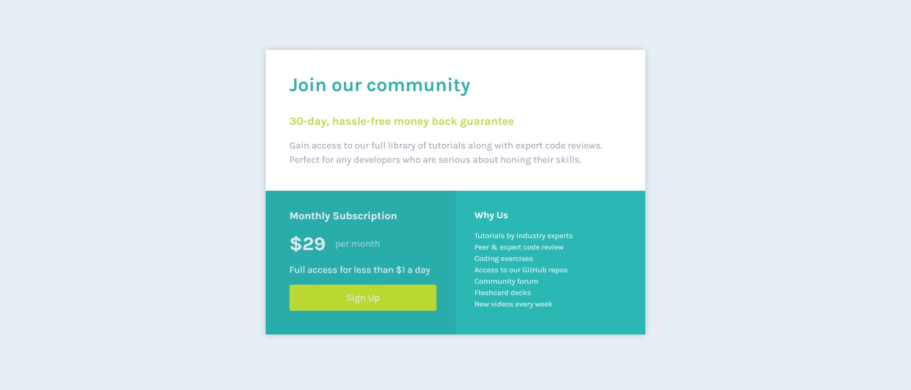

# Frontend Mentor - Single price grid component solution

This is a solution to the [Single price grid component challenge on Frontend Mentor](https://www.frontendmentor.io/challenges/single-price-grid-component-5ce41129d0ff452fec5abbbc). Frontend Mentor challenges help you improve your coding skills by building realistic projects. 

## Table of contents

  - [The challenge](#the-challenge)
  - [Screenshot](#screenshot)
  - [Links](#links)
  - [Built with](#built-with)
  - [What I learned](#what-i-learned)
- [Author](#author)

### The challenge

Users should be able to:

- View the optimal layout for the component depending on their device's screen size
- See a hover state on desktop for the Sign Up call-to-action

### Screenshot

### Links

- Solution URL: [Add solution URL here](https://your-solution-url.com)
- Live Site URL: [Add live site URL here](https://your-live-site-url.com)

### Built with

- Semantic HTML5 markup
- CSS custom properties
- Flexbox

### What I learned

In this project small project I practiced the basic conceps of html and css.
A learned a comcept i was'nt familiar with that is: filter: brightness();
I used it to make small changes in the colors defined in the style guide, to make the two bottom container look a bit different for instance.

## Author

- Website - [TBD](https://www.your-site.com)
- Frontend Mentor - [@RibeiroPorto](https://www.frontendmentor.io/profile/RibeiroPorto)
- LinkedIn - [Vinicius Ribeiro](https://www.linkedin.com/in/vinicius-ribeiro-8676b9234/)

